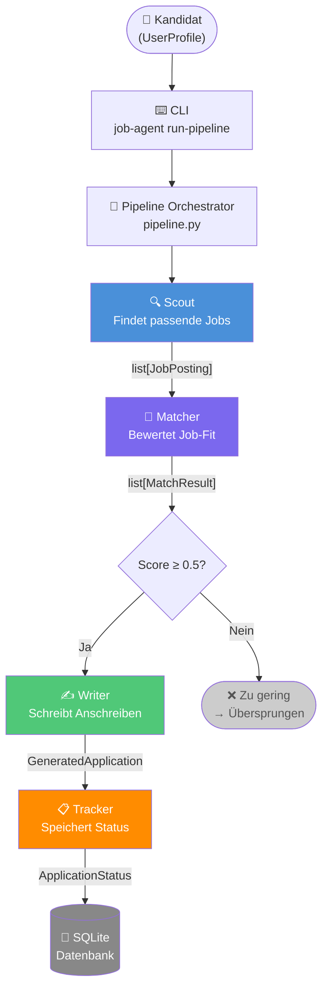
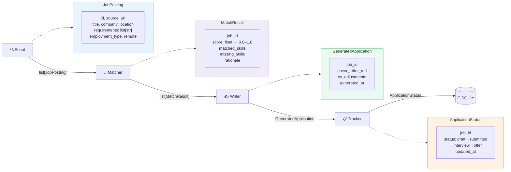
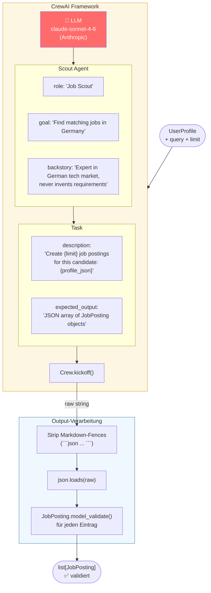
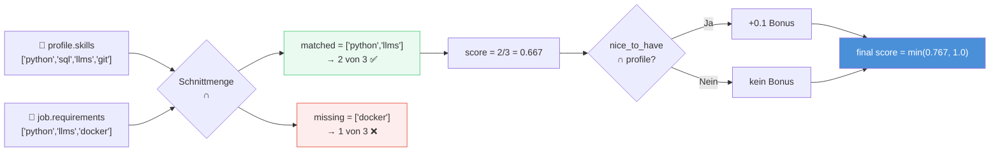
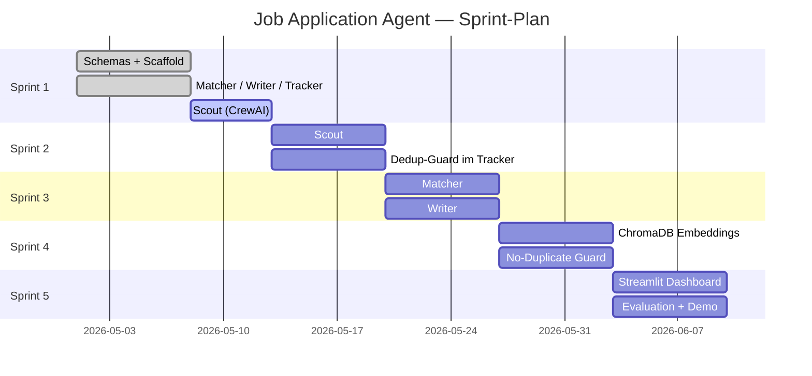

# Sprint 1 — Präsentationsdiagramme

> Render-Tool: https://mermaid.live  
> Einfach den Code-Block reinkopieren → Screenshot für PowerPoint

---

## Diagramm 1: System-Architektur (Gesamtüberblick)



---

## Diagramm 2: Pydantic Schemas — Die Verträge zwischen den Agents



---

## Diagramm 3: Scout Agent — CrewAI Innenleben



---

## Diagramm 4: Matcher — Scoring-Logik (Sprint 1)



---

## Diagramm 5: Sprint-Roadmap



---

## Wie du die Diagramme verwendest

1. Gehe zu **https://mermaid.live**
2. Kopiere einen Code-Block (zwischen den ` ``` ` Zeichen)
3. Füge ihn links im Editor ein → rechts siehst du das Diagramm
4. Klicke **PNG** oder **SVG** zum Download
5. Bild in PowerPoint/Keynote einfügen
